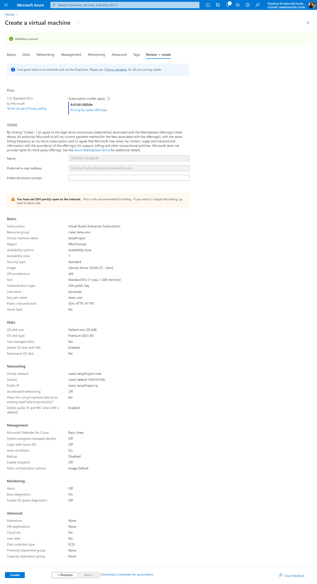
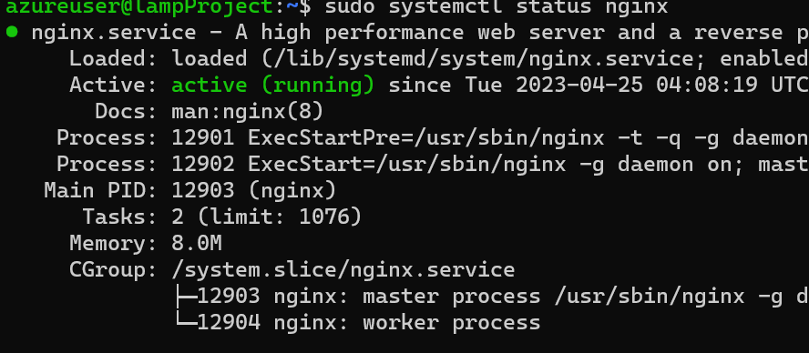
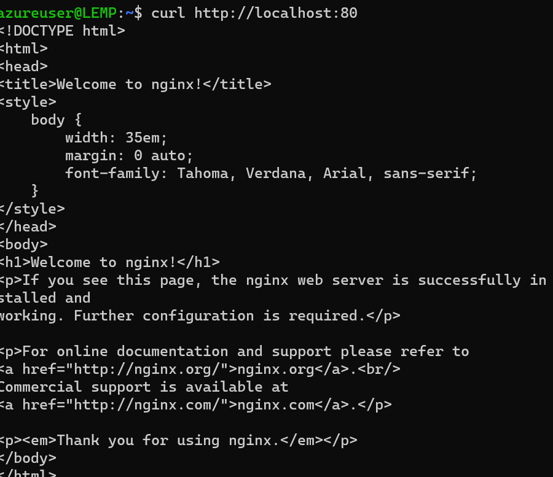
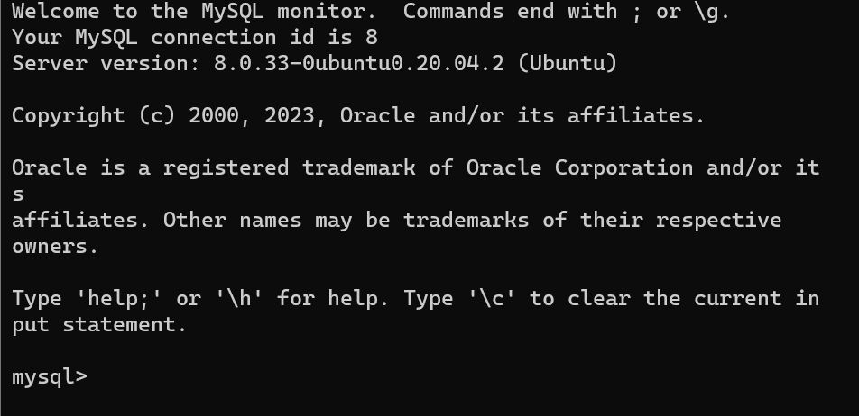
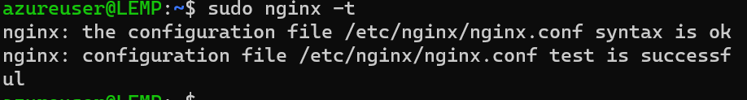
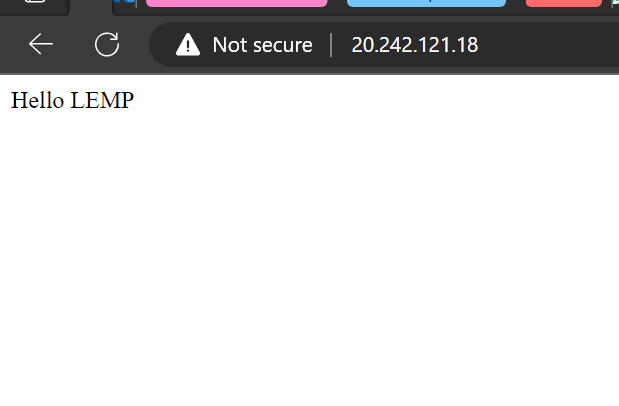
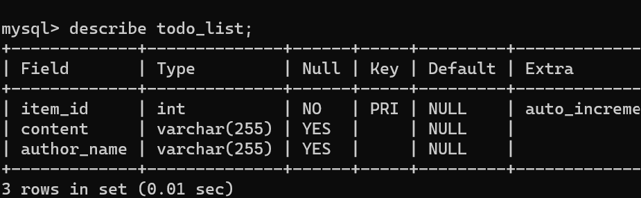
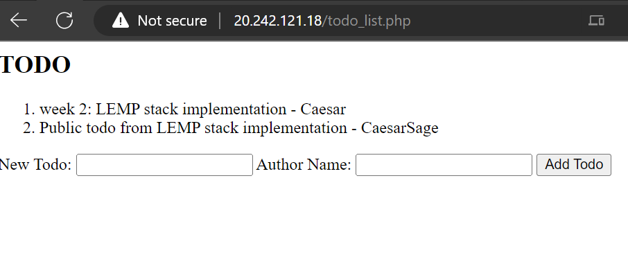

# LEMP STACK IMPLEMENTATION

- L - Linux
- E - Nginx
- M - MySQL
- P - PHP

## Documentation

We will be using Ubuntu Virtual Machine through AZURE.



After creating the VM, Login and we will be using the following commands to update the VM

```bash
sudo apt update
sudo apt upgrade
```

## Installing Nginx

Nginx is a simple web server that is very popular. It is often used to serve PHP applications, but it can also serve static HTML content.

Next, we will be installing the following packages

```bash
sudo apt install nginx
```

* The nginx package installs Nginx and the default configuration is to run Nginx as a daemon. Once the nginx package finishes installing, you can go to your server’s IP address in your browser and see the default Nginx landing page.

Then check the status of the nginx service

```bash
sudo systemctl status nginx
```


This will show you the status of the nginx service. If it is not running, you can start it with this command:

```bash
sudo systemctl start nginx
```

You could also use `curl` to check if the nginx service is running

```bash
curl http://localhost:80
```

This display the nginx default page in the terminal as text.


or you can open the browser and use the public IP address of the VM to see the default page
```bash
http://<public-ip-address>:80
```

## Installing MySQL

Next, we will be installing MySQL. MySQL is a database management system. It is used to store and manage the data used by your website or application.


```bash
sudo apt install mysql-server -y
```

After the installation, we will be running a security script that comes pre-installed with MySQL. This script will remove some insecure default settings and lock down access to your database system. Start the interactive script by running:

```bash
sudo mysql_secure_installation
```

This will ask if you want to configure the VALIDATE PASSWORD PLUGIN, After the validation is completed, login to MYSQL and input the password by adding the -p flag.

```bash
sudo mysql -u root -p
```



Now let's create a database and a user for our application. We will create a database called `projectLEMP` and a user called `projectLEMPuser` with the password `password`.

```sql
CREATE DATABASE projectLEMP;
```
Next, we will create a user and grant it access to the database we just created. Remember to choose a strong password here for your database user:

```sql
CREATE USER 'projectLEMPuser'@'localhost' IDENTIFIED WITH mysql_native_password BY 'password';
```

Then grant the user access to the database we created:

```sql
GRANT ALL ON projectLEMP.* TO 'projectLEMPuser'@'localhost';
```

Then flush the privileges to ensure that they are saved and available in the current session:

```sql
FLUSH PRIVILEGES;
```

Then exit MySQL, we will come back to creating tables and inserting data later:

```sql
exit
```

## Installing PHP

Next, we will be installing PHP. PHP is the component of our setup that will process code to display dynamic content to the end user. In addition to the php package, you’ll need php-mysql, a PHP module that allows PHP to communicate with MySQL-based databases. You’ll also need libapache2-mod-php to enable Apache to handle PHP files. Core PHP packages will automatically be installed as dependencies.

```bash
sudo apt install php-fpm php-mysql -y
```

## Configuring Nginx to Use the PHP Processor

Next, we will be configuring Nginx to use the PHP processor for dynamic content. We do this on the server block level (server blocks are similar to Apache’s virtual hosts). 
We will create a folder called projectLEMP for our webserver.
Create the root web directory for your_domain in /var/www/ folder as follows:


```bash
sudo mkdir /var/www/projectLEMP
```

Next, assign ownership of the directory with the $USER environment variable, which will reference your current system user:

```bash
sudo chown -R $USER:$USER /var/www/projectLEMP
```

Then, we will create a sample index.html page in that location so that we can test that the server block works as expected:

```bash
nano /var/www/projectLEMP/index.html
```

Add the following HTML content in the index.html file. This is just a sample page to test that our server block works as expected.

```html
<html>
    <head>
        <title>Welcome to projectLEMP!</title>
    </head>
    <body>
        <h1>Hello LEMP </h1>
    </body>
</html>
```

Then save and close the file.

Next, we will create a server block configuration file for our domain called projectLEMP in the /etc/nginx/sites-available/ directory, so let’s create that file:

```bash
sudo nano /etc/nginx/sites-available/projectLEMP
```

Add the following script to the file.
**NOTE your php version, here i am using php7.4**

```s
server {
        listen 80;
        server_name projectLEMP www.projectLEMP;
        root /var/www/projectLEMP;

        index index.html index.htm index.php;

        location / {
                try_files $uri $uri/ =404;
        }

        location ~ \.php$ {
                include snippets/fastcgi-php.conf;
                fastcgi_pass unix:/var/run/php/php7.4-fpm.sock;
        }

        location ~ /\.ht {
                deny all;
        }
  }
```

Save and close.

Next, we will enable the server block configuration file by creating a symbolic link from that file to the sites-enabled directory, which Nginx reads from during startup:

```bash
sudo ln -s /etc/nginx/sites-available/projectLEMP /etc/nginx/sites-enabled/
```

Then, we will test to make sure that there are no syntax errors in any of our Nginx files:

```bash
sudo nginx -t
```



Disable the default Nginx server block file we don’t need:

```bash
sudo unlink /etc/nginx/sites-enabled/default
```

If there aren’t any problems, restart Nginx to enable your changes:

```bash
sudo systemctl restart nginx
```

Now we can test that our server block works by going to our domain or public IP address in our web browser. You’ll see the sample Nginx landing page:

```bash
http://<your_domain_or_IP>
```



## Testing PHP with Nginx

We can do a quick test by creating a phpinfo.php file in our document root. Open a new file called phpinfo.php within your document root in your text editor:

```bash
nano /var/www/projectLEMP/info.php
```

Add in the following line:

```php
<?php
phpinfo();
```

Save and close the file.

Now we can test whether our web server can correctly display content generated by a PHP script. To try this out, we just have to visit this page in our web browser. You’ll need your server’s public IP address again.

```bash
http://<your_domain_or_IP>/info.php
```


### ADDING AND RETRIEVING DATA FROM MYSQL DATABASE USING PHP

Now we will create a simple todo list application that will allow us to add items to a list and retrieve them. We will use a MySQL database to store the todo items. We will use PDO (PHP Data Objects) to connect to the database and perform the necessary operations.

First, we will create a table in our database 'projectLEMP' that we created earlier. We will call the table 'todo_list'. We will use the following SQL query to create the table:

- login to mysql
```bash
 mysql -u projectLEMPuser -p projectLEMP
```

- Creating the table
```sql
CREATE TABLE todo_list (
  id INT NOT NULL AUTO_INCREMENT,
  content VARCHAR(255) NOT NULL,
  author VARCHAR(255) NOT NULL,
  PRIMARY KEY (id)
);
```



exit mysql

```bash
exit
```

Next, we will create a file called todo_list.php in our document root:

```bash
nano /var/www/projectLEMP/todo_list.php
```

Add the following script to the file:
```php
<?php
$user = "projectLEMPuser";
$password = "password";
$database = "projectLEMP";
$table = "todo_list";

// Handle form submission
if ($_SERVER['REQUEST_METHOD'] === 'POST' && isset($_POST['todo']) && isset($_POST['author'])) {
  $todo = $_POST['todo'];
  $author = $_POST['author'];
  
  try {
    $db = new PDO("mysql:host=localhost;dbname=$database", $user, $password);
    
    // Insert the new todo and author into the database
    $stmt = $db->prepare("INSERT INTO $table (content, author_name) VALUES (?, ?)");
    $stmt->execute([$todo, $author]);
    
    // Redirect to the same page to avoid form resubmission
    header("Location: " . $_SERVER['PHP_SELF']);
    exit();
  } catch (PDOException $e) {
    print "Error!: " . $e->getMessage() . "<br/>";
    die();
  }
}

// Display existing todos
try {
  $db = new PDO("mysql:host=localhost;dbname=$database", $user, $password);
  
  echo "<h2>TODO</h2><ol>";
  foreach($db->query("SELECT content, author_name FROM $table") as $row) {
    echo "<li>" . $row['content'] . " - " . $row['author_name'] . "</li>";
  }
  echo "</ol>";
} catch (PDOException $e) {
  print "Error!: " . $e->getMessage() . "<br/>";
  die();
}

?>

<form method="POST">
  <label for="todo">New Todo:</label>
  <input type="text" name="todo" id="todo" required>
  <label for="author">Author Name:</label>
  <input type="text" name="author" id="author" required>
  <button type="submit">Add Todo</button>
</form>
```

Save and close the file.

Now we can test our todo list application by going to the following URL in our web browser:

```bash
http://<your_domain_or_IP>/todo_list.php
```



## Conclusion

In this tutorial, we have successfully installed LEMP stack on Ubuntu 20.04. We have also created a simple todo list application that allows us to add items to a list and retrieve them. We have used a MySQL database to store the todo items. We have used PDO (PHP Data Objects) to connect to the database and perform the necessary operations.

# Destroy Azure VM

To destroy the VM, go to the Azure portal and delete the resource group.

See you in the next project next week.


[Project 3: MERN STACK IMPLEMENTATION ](../project-03/README.md/)


