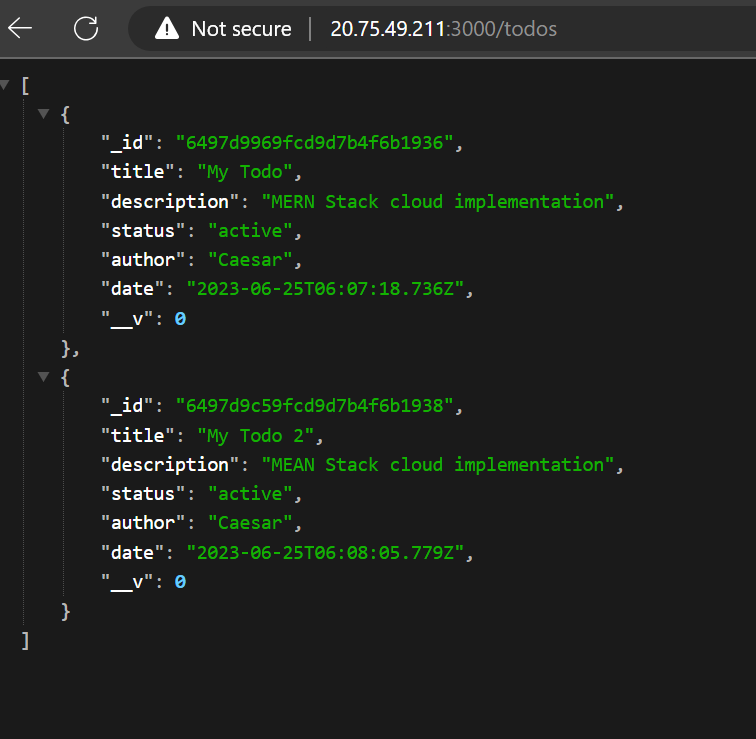

# Azure MERN WEB STACK

- M - MongoDB
- E - Express
- R - React
- N - Node

# Documentation

This project shows how to create a MERN stack application using Azure.

# Creating the Azure VM

Again we will be using Ubuntu Virtual Machine through AZURE.


After creating the VM, Login and we will be using the following commands to update the VM

```bash
sudo apt update -y
sudo apt upgrade -y
```

# Installing MongoDB

MongoDB is a document-oriented NoSQL database used for high volume data storage. Instead of using tables and rows as in the traditional relational databases, MongoDB makes use of collections and documents. Documents consist of key-value pairs which are the basic unit of data in MongoDB. Collections contain sets of documents and function which is the equivalent of relational database tables. MongoDB is a cross-platform, document-oriented database that provides, high performance, high availability, and easy scalability.


```bash
sudo apt install mongodb -y
```


- To login to MongoDB, run the following command:

```bash
mongo
```

- To see the databases, run the following command:

```bash
show dbs
```


Exit from MongoDB

```bash
exit
```

# Installing NodeJS

Node.js is an open-source, cross-platform, JavaScript runtime environment that executes JavaScript code outside of a web browser. Node.js lets developers use JavaScript to write command line tools and for server-side scripting—running scripts server-side to produce dynamic web page content before the page is sent to the user's web browser.

```bash
sudo apt install nodejs -y
```

**Note:** The command installs both Node.js and npm, the Node.js package manager. npm is used to install Node.js programs from the registry, organizing the installation and management of third-party Node.js programs.

Lets's verify the version

```bash
  node -v
```

Also verify the version of npm

```bash
  npm -v
```


**Note**: you must install version 14.17.0 or higher else run the following

```bash
npm install -g n
sudo n stable

```


# Application Setup and Installing Express

Express is a minimal and flexible Node.js web application framework that provides a robust set of features for web and mobile applications. It is an open-source framework developed and maintained by the Node.js foundation.

- First lets create a directory for our application

```bash
  mkdir myapp
```

- Then change directory to myapp

```bash
  cd myapp
```

- Then we will be creating a package.json file

```bash
  npm init -y
```


- Then we will be installing express

```bash
  npm install express
```


- Now that our application is setup, we will be creating a file called `index.js` to run our application

```bash
  touch index.js
```

- Then we will be adding the following code to our `index.js` file

- open the file with `vim` or `nano`

```js
  const express = require('express')
  const app = express()
  const port = 3000

  app.get('/', (req, res) => {
    res.send('Hello World!')
  })

  app.listen(port, () => {
    console.log(`Example app listening at http://localhost:${port}`)
  })
```

- Then we will be running our application

```bash
  node index.js
```


- To allow traffic on port 3000 from our vm we will be adding an inbound rule to our network security group.

- On your Azure Portal, go to your VM and click on `Networking` and then `Add inbound port rule`


- Then we will be running our application again

```bash
  node index.js
```
Open your browser and go to `http://<your-ip-address>:3000`


# Improving and Defining routes for our application

- Let's improve our basic application to a `Todo` application. We will create a new folder called `routes` and create a file called `index.js`.

```bash
  mkdir routes
  touch routes/index.js
```

- Then we will be adding the following code to our `index.js` file

```js
  const express = require('express')
  const router = express.Router()

  router.get('/', (req, res) => {
    res.send('Hello World!')
  })

  module.exports = router
```

- Then we will be adding the following code to our `index.js` file

```js
  const express = require('express')
  const app = express()
  const port = 3000

  const indexRouter = require('./routes/index')

  app.use('/', indexRouter)

  app.listen(port, () => {
    console.log(`Example app listening at http://localhost:${port}`)
  })
```

# Adding MongoDB to our application and creating models

- First we will be installing mongoose in our application

Mongoose is a MongoDB object modeling tool designed to work in an asynchronous environment. Mongoose supports both promises and callbacks.

It will allow us to connect to our MongoDB database and define models for our application.

```bash
  npm install mongoose
  npm install cors
```
- cors is a node.js package for providing a Connect/Express middleware that can be used to enable CORS with various options.

- Then we will be creating a folder called `models` and create a file called `todo.js`

```bash
  mkdir models
  touch models/todo.js
```

- Then we will be adding the following code to our `todo.js` file

```js
  const mongoose = require('mongoose')

  const todoSchema = new mongoose.Schema({
    title: {
      type: String,
      required: true
    },
    description: {
      type: String,
      required: true
    },
    status: {
      type: String,
      enum: ['active', 'inactive'],
      required: true
    },
    date: {
      type: Date,
      default: Date.now
    },
    author: {
      type: String,
      required: true
    }
  })

  module.exports = mongoose.model('Todo', todoSchema)
```

- Then we will be adding the following code to our `index.js` file

```js
  const express = require('express');
  const mongoose = require('mongoose');
  const cors = require('cors')
  const path = require('path');
  require('dotenv').config();

  const app = express();

  const port = 3000

  //connect to the database
  mongoose.connect(process.env.DB, { useNewUrlParser: true, useUnifiedTopology: true })
  .then(() => console.log(`Database connected successfully`))
  .catch(err => console.log(err));

  //since mongoose promise is depreciated, we overide it with node's promise
  mongoose.Promise = global.Promise;

  app.use(express.json())
  app.use(cors())

  const indexRouter = require('./routes/index')

  app.use('/', indexRouter)

  app.listen(port, () => {
    console.log(`Example app listening at http://localhost:${port}`)
  })
```

Here, we are using MongoDB on our local machine. You will need to be using MongoDB Atlas in our production environment.

**Note**: You will need to create a database called `todo` in your MongoDB instance by
  
```bash
  mongo
  use todo
```

# Adding controllers to our application

- First we will be creating a folder called `controllers` and create a file called `todos.js` to perform CRUD operations on our `Todo` model

```bash
  mkdir controllers
  touch controllers/todos.js
```

- Then we will be adding the following code to our `todos.js` file

```js
  const Todo = require('../models/todo')

  const getAllTodos = async (req, res) => {
    try {
      const todos = await Todo.find()
      res.json(todos)
    } catch (error) {
      res.status(500).json({ message: error.message })
    }
  }

  const getTodo = async (req, res) => {
    try {
      const todo = await Todo.findById(req.params.id)
      res.json(todo)
    } catch (error) {
      res.status(500).json({ message: error.message })
    }
  }

  const createTodo = async (req, res) => {
    try {
      const todo = new Todo({
        title: req.body.title,
        description: req.body.description,
        status: req.body.status,
        author: req.body.author
      })

      const newTodo = await todo.save()

      res.status(201).json(newTodo)
    } catch (error) {
      res.status(400).json({ message: error.message })
    }
  }

  const updateTodo = async (req, res) => {
    try {
      const todo = await Todo.findById(req.params.id)

      if (req.body.title) {
        todo.title = req.body.title
      }

      if (req.body.description) {
        todo.description = req.body.description
      }

      if (req.body.status) {
        todo.status = req.body.status
      }

      if (req.body.author) {
        todo.author = req.body.author
      }

      const updatedTodo = await todo.save()

      res.json(updatedTodo)
    } catch (error) {
      res.status(400).json({ message: error.message })
    }
  }

 const deleteTodo = async (req, res) => {
  try {
    const deletedTodo = await Todo.findOneAndDelete({ _id: req.params.id });

    if (!deletedTodo) {
      return res.status(404).json({ message: 'Todo not found' });
    }

    res.json(deletedTodo);
  } catch (error) {
    res.status(500).json({ message: error.message });
  }
};


  module.exports = {
    getAllTodos,
    getTodo,
    createTodo,
    updateTodo,
    deleteTodo
  }
```

Now let's update our `index.js` in the route folder to use the controller functions

```js
  const express = require('express')
  const router = express.Router()

  const {
    getAllTodos,
    getTodo,
    createTodo,
    updateTodo,
    deleteTodo
  } = require('../controllers/todos')

  router.get('/todos', getAllTodos)

  router.get('/todos/:id', getTodo)

  router.post('/todos', createTodo)

  router.put('/todos/:id', updateTodo)

  router.delete('/todos/:id', deleteTodo)

  module.exports = router
```

Start your server and test the endpoints using Postman


## Create


## Get


---

## Delete


You can explore the other endpoints using Postman.
Now we are done with this basic application server.
# Creating a frontend for our application with React

Next, is to create a front end ui for our application. We will be using React for this.

- First we will be creating a folder called `client` and initialize a react application in it

```bash
  mkdir client
  cd client
  npx create-react-app .
```

- Since we are already using port 3000 for our server, we will be using port 3001 for our react application. So we will be adding the following code to our `package.json` file

```json
  "scripts": {
    "start": "PORT=3001 react-scripts start",
    "build": "react-scripts build",
    "test": "react-scripts test",
    "eject": "react-scripts eject"
  },
```

**Then you will need to create an inbound rule for port 3001 in your azure VM as we did earlier**

- Then we will be adding the following code to our `App.js` file

```js
  import React from 'react';
  import './App.css';

  function App() {
    return (
      <div className="App">
        <h1>Todo App</h1>
      </div>
    );
  }

  export default App;
```

- Then we will be adding the following code to our `App.css` file

```css
  .App {
    text-align: center;
  }
```

- Then we will be adding the following code to our `index.js` file

```js
  import React from 'react';
  import ReactDOM from 'react-dom';
  import './index.css';
  import App from './App';
  import * as serviceWorker from './serviceWorker';

  ReactDOM.render(
    <React.StrictMode>
      <App />
    </React.StrictMode>,
    document.getElementById('root')
  );

  // If you want your app to work offline and load faster, you can change
  // unregister() to register() below. Note this comes with some pitfalls.
  // Learn more about service workers: https://bit.ly/CRA-PWA
  serviceWorker.unregister();
```

- Then we will be adding the following code to our `index.css` file

```css
  body {
    margin: 0;
    font-family: -apple-system, BlinkMacSystemFont, 'Segoe UI', 'Roboto', 'Oxygen',
      'Ubuntu', 'Cantarell', 'Fira Sans', 'Droid Sans', 'Helvetica Neue',
      sans-serif;
    -webkit-font-smoothing: antialiased;
    -moz-osx-font-smoothing: grayscale;
  }

  code {
    font-family: source-code-pro, Menlo, Monaco, Consolas, 'Courier New',
      monospace;
  }
```

- Then we will be adding the following code to our `package.json` file

```json
  {
    "name": "client",
    "version": "0.1.0",
    "private": true,
    "dependencies": {
      "@testing-library/jest-dom": "^4.2.4",
      "@testing-library/react": "^9.5.0",
      "@testing-library/user-event": "^7.2.1",
      "react": "^16.13.1",
      "react-dom": "^16.13.1",
      "react-scripts": "3.4.1"
    },
    "scripts": {
      "start": "react-scripts start",
      "build": "react-scripts build",
      "test": "react-scripts test",
      "eject": "react-scripts eject"
    },
    "eslintConfig": {
      "extends": "react-app"
    },
    "browserslist": {
      "production": [
        ">0.2%",
        "not dead",
        "not op_mini all"
      ],
      "development": [
        "last 1 chrome version",
        "last 1 firefox version",
        "last 1 safari version"
      ]
    }
  }
```

- Next, lets create a folder called `components` and create a file called `Todo.js` in it

```js
  import React from 'react'

  const Todo = () => {
    return (
      <div>
        <h1>Todo Component</h1>
      </div>
    )
  }

  export default Todo
```

- Then we will be adding the following code to our `App.js` file

```js
  import React from 'react';
  import './App.css';
  import Todo from './components/Todo'

  function App() {
    return (
      <div className="App">
        <Todo />
      </div>
    );
  }

  export default App;
```

- Then we will be adding the following code to our `Todo.js` file

```js
  import React, { useState, useEffect } from 'react'
  import axios from 'axios'

  const Todo = () => {
    const [todos, setTodos] = useState([])

    useEffect(() => {
      const fetchTodos = async () => {
        const { data } = await axios.get('/todos')
        setTodos(data)
      }

      fetchTodos()
    }, [])

    return (
      <div>
        <h1>Todo Component</h1>
        {todos.map(todo => (
          <div key={todo._id}>
            <h2>{todo.title}</h2>
            <p>{todo.description}</p>
          </div>
        ))}
      </div>
    )
  }

  export default Todo
```
- Let's add functionality to be able to create, update and delete todos

- First we will be adding the following code to our `Todo.js` file

```jsx
  import React, { useState, useEffect } from 'react'
  import axios from 'axios'

  const Todo = () => {
    const [todos, setTodos] = useState([])
    const [title, setTitle] = useState('')
    const [description, setDescription] = useState('')
    const [status, setStatus] = useState('active')
    const [author, setAuthor] = useState('')

    useEffect(() => {
      const fetchTodos = async () => {
        const { data } = await axios.get('/todos')
        setTodos(data)
      }

      fetchTodos()
    }, [])

    const handleSubmit = async (e) => {
      e.preventDefault()

      const { data } = await axios.post('/todos', {
        title,
        description,
        status,
        author
      })

      setTodos([...todos, data])
      setTitle('')
      setDescription('')
      setStatus('active')
      setAuthor('')
    }

    const handleDelete = async (id) => {
      await axios.delete(`/todos/${id}`)
      const newTodos = todos.filter(todo => todo._id !== id)
      setTodos(newTodos)
    }

    return (
      <div>
        <h1>Todo Component</h1>
        <form onSubmit={handleSubmit}>
          <input
            type="text"
            placeholder="Title"
            value={title}
            onChange={(e) => setTitle(e.target.value)}
          />
          <input
            type="text"
            placeholder="Description"
            value={description}
            onChange={(e) => setDescription(e.target.value)}
          />
          <button type="submit">Create Todo</button>
        </form>
        {todos.map(todo => (
          <div key={todo._id}>
            <h2>{todo.title}</h2>
            <p>{todo.description}</p>
            <button onClick={() => handleDelete(todo._id)}>Delete</button>
          </div>
        ))}
      </div>
    )
  }

  export default Todo
```

Assuming no errors when saving all these files, our To-Do app should be ready and fully functional with the functionality discussed earlier: creating a task, deleting a task and viewing all your tasks.

[Project 4: MEAN STACK](../project-03/README.md/)
