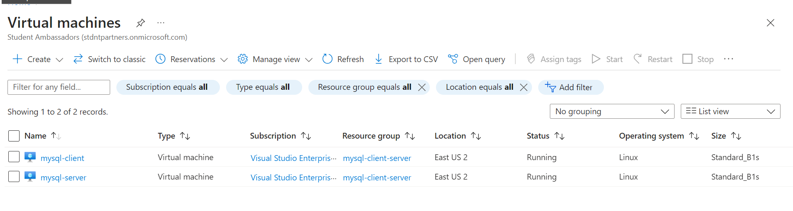
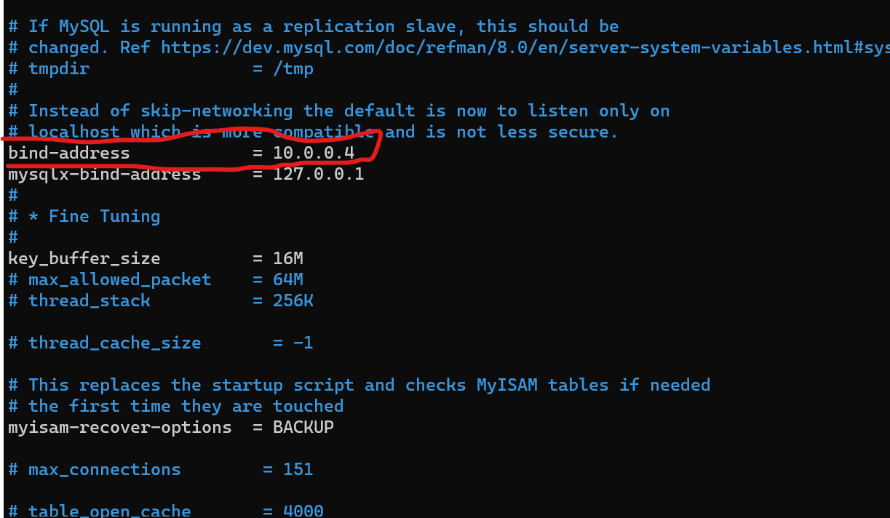
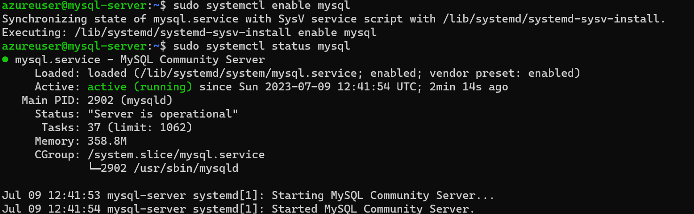
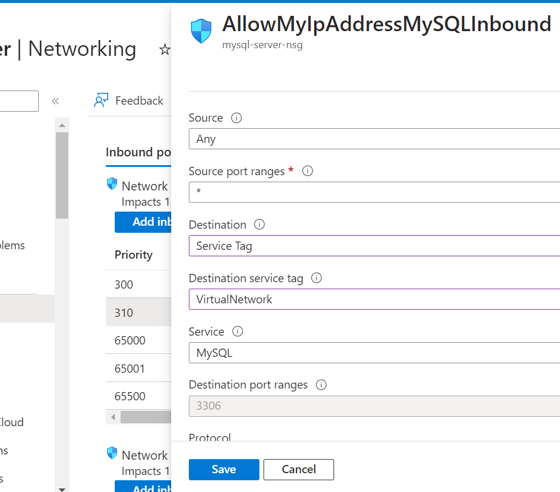
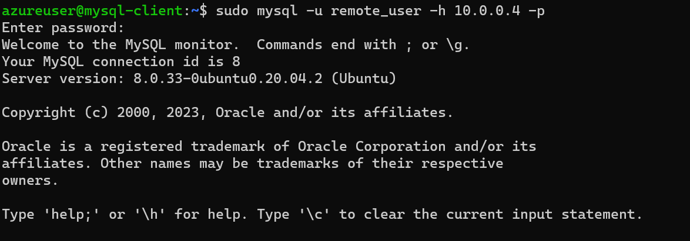
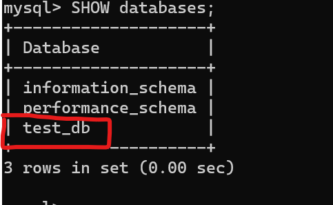

# IMPLEMENT A CLIENT SERVER ARCHITECTURE USING MYSQL DATABASE MANAGEMENT SYSTEM (DBMS).


To Demostrate a basic client-server using MySQL DBMS, we will be using the following tools:

- MySQL DBMS
- Two Azure Virtual Machines (VMs)
  - mysql-server
  - mysql-client

## Create two Virtual Machines on Azure on the same virtual network

 - mysql-server
 - mysql-client



- Update and Upgrade the Linux Virtual Machine

```bash
sudo apt-get update
sudo apt-get upgrade
```

## Installing MySQL Server on the Server VM

- Back to the mysql-server vm

- Install MySQL Server on the Server VM

```bash
sudo apt-get install mysql-server -y
```

- enable mysql service

```bash
sudo systemctl enable mysql
```

- Check if MySQL server is running
  
```bash
  sudo systemctl status mysql
```

- if it is not running
  
```bash
  sudo systemctl start mysql
```

- For MySQL secure installation, use the command

```bash
sudo mysql_secure_installation;
```

- Then Set root user password

```sql
ALTER USER 'root'@'localhost' IDENTIFIED WITH mysql_native_password by 'password';
```

- Then on the server, let's create a new user and and it's database to test our connection later from the client vm

```sql
CREATE USER 'remote_user'$'%' IDENTIFIED WITH mysql_native_password BY 'password';
```

- Grant all privileges to the new user

```sql
GRANT ALL PRIVILEGES ON *.* TO 'remote_user'@'%';
```

- Create a new database

```sql
CREATE DATABASE test_db;
```


- Exit

```sql
exit;
```

## Binding mysql connection to private IP

Next we need to configure the MySQL server to allow connections from remote hosts

- Open the MySQL configuration file

```bash
sudo nano /etc/mysql/mysql.conf.d/mysqld.cnf
```
- Replace the bind-address with the private IP address of the server. In my case `10.0.0.4`



- Restart the MySQL server

```bash
sudo systemctl restart mysql
```

- Check the status of the MySQL server

```bash
sudo systemctl status mysql
```



- Now we can test the connection from the client vm

## Installing MySQL Server on the Client VM

- Back to the mysql-client vm

- First install MySQL Server on the Client VM

```bash
sudo apt-get install mysql-client -y
```

## Establishing a connection to MySQL server

- Back to Azure Portal

- Since both vm are located in the same virtual network, so they can communicate with each other using the private IP addresses.

- Modify the mysql-server NSG to allow inbound connections from client server.



- After adding the rulw, On the mysql-client vm, we can connect to the mysql-server using the command

```bash
sudo mysql -u remote_user -h <privateIp> -p 
```



- Show databases

```sql
SHOW DATABASES;
```



if you can see the test_db database, then the connection is successful.

- Exit

```sql
exit;
```

Thanks for reading.

See you next week 

[Project 6: WEB SOLUTION WITH WORDPRESS](../project-06/README.md/)
