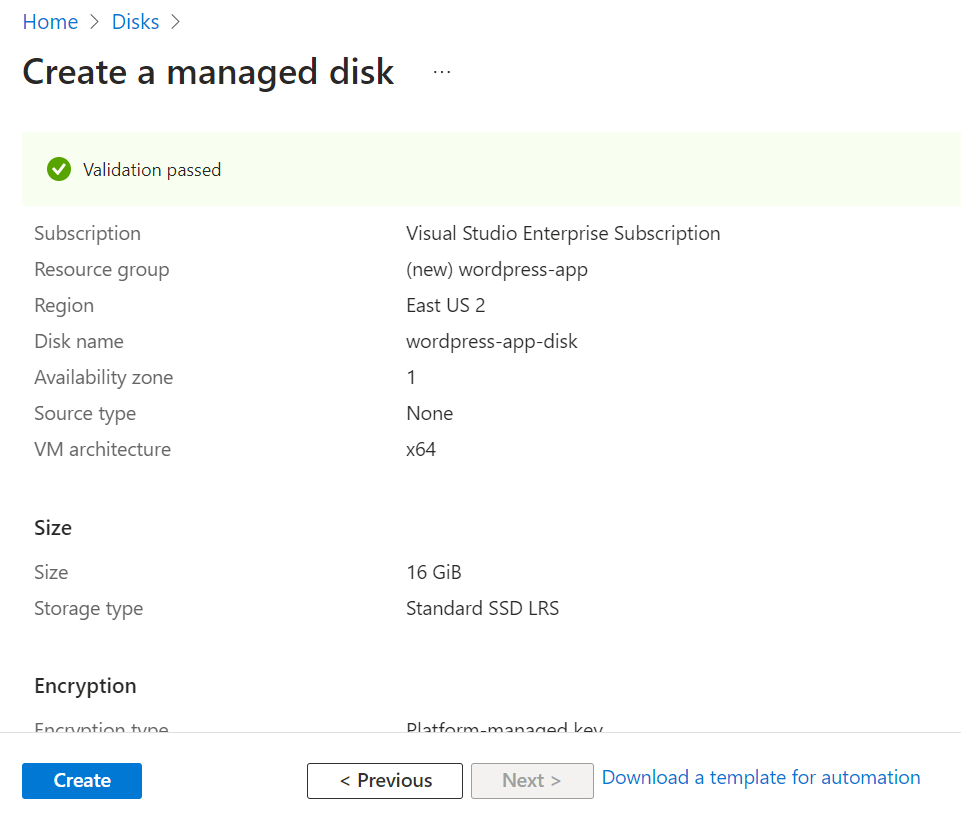

# Three-tier Architecture Implemention Of Wordpress Web Solution

Generally, web, or mobile solutions are implemented based on what is called the Three-tier Architecture.

Three-tier Architecture is a client-server software architecture pattern that comprise of 3 separate layers.

Your 3-Tier Setup

- A Laptop or PC to serve as a client
- An VM Linux Server as a web server (This is where you will install WordPress)
- An VM Linux server as a database (DB) serve

## Create a new managed disk

The managed disk will be used as data disk for the virtual machine.



## Create a VM using Ubuntu Distribution

The VM will serve as a Web Server, create/attach the two managed disk earlie created in the same AZ as the Web Srver VM, each of 16GB.


### Setting up the Web Server VM

### 1/2. ssh into the Web Server with your private keys

### 3. Update and Upgrade the system

```bash
sudo apt update && sudo apt upgrade -y
```
### 4. Use `lsblk` command to inspect what block devices are attached to the server. Notice names of your newly created devices. 

- All devices in Linux reside in `/dev/` directory. 
- Inspect it with ls /dev/ and make sure you see all 3 newly created block devices there – their names will likely be `sda`, `sdb`, `sdc`, etc. 
- In my case, they are `sda`,  `sdd`. Where `sdb` is the OS disk, `sda` is the first data disk and `sdd` is the second data disk.


### 5. Use `df -h` command to see all mounts and free space on your server


### 6. Use `gdisk` utility to create a single partition on each of the disks attached to the server

```bash
sudo gdisk /dev/sda
sudo gdisk /dev/sdd
```

### 7. Use `lsblk` utility to view the newly configured partition on each of the 3 disks.


### 8. Install lvm2 package using `sudo yum install lvm2` if not already existing in the server. 

- Run `sudo lvmdiskscan` command to check for available partitions.


### 9. Use `pvcreate` utility to mark each of 3 disks as physical volumes (PVs) to be used by LVM.

```bash
  pvcreate /dev/sda1
  pvcreate /dev/sdd1
```


### 10. Use `vgcreate` utility to add all 3 PVs to a volume group (VG). Name the VG **webdata-vg**

```bash
  sudo vgcreate webdata-vg /dev/xvdh1 /dev/sda1 /dev/sdd1
```


### 11. verify that VG has been created 

```bash
  sudo vgs
```


### 12. Use `lvcreate` utility to create 2 logical volumes. 

- `apps-lv (Use half of the PV size), and logs-lv Use the remaining space of the PV size`. 

> NOTE: apps-lv will be used to store data for the Website while, logs-lv will be used to store data for logs.

```bash
sudo lvcreate -n apps-lv -L 15G webdata-vg
sudo lvcreate -n logs-lv -L 15G webdata-vg
```

### 13. Verify that your Logical Volume has been created successfully by running sudo lvs


### 14. Verify the entire setup


### 15. Use `mkfs.ext4` to format the logical volumes with `ext4` filesystem

```bash
sudo mkfs -t ext4 /dev/webdata-vg/apps-lv
sudo mkfs -t ext4 /dev/webdata-vg/logs-lv
```


### 16. Create /var/www/html directory to store website files

```bash
sudo mkdir -p /var/www/html
```

### 17. Create /home/recovery/logs to store backup of log data

```bash
sudo mkdir -p /home/recovery/logs
```

### 18. Mount /var/www/html on apps-lv logical volume


```bash 
sudo mount /dev/webdata-vg/apps-lv /var/www/html/
```

### 19. Use rsync utility to backup all the files in the log directory /var/log into /home/recovery/logs 
- (This is required before mounting the file system)


```bash
sudo rsync -av /var/log/. /home/recovery/logs/
```


### 20. Mount /var/log on logs-lv logical volume. 
- (Note that all the existing data on /var/log will be deleted. That is why step 15 above is veryimportant)


```bash
  sudo mount /dev/webdata-vg/logs-lv /var/log
```


### 21. Restore log files back into /var/log directory


```bash
  sudo rsync -av /home/recovery/logs/. /var/log
```


### 22. Update /etc/fstab file so that the mount configuration will persist after restart of the server.


**UPDATE THE `/ETC/FSTAB` FILE**


The UUID of the device will be used to update the /etc/fstab file;


```bash
sudo blkid
```


```bash
sudo vi /etc/fstab
```

- Update /etc/fstab in this format using your own UUID and rememeber to remove the leading and ending quotes.


Test the configuration and reload the daemon

```bash
  sudo mount -a
  sudo systemctl daemon-reload
```

- Verify your setup by running df -h, output must look like this:


## Prepare the Database Server
