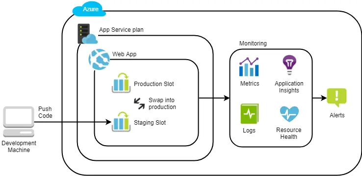

# Deploying and Monitoring Web Apps in Azure App Service



## Description

Azure App Service is a fully-managed platform as a service (PaaS) for building, deploying, and scaling web, mobile, API, and even serverless apps. In this Lab, you will learn all about App Service by deploying an ASP.NET Core app to Azure App Service Web Apps. You will also use a variety of services to monitor the app, including the Application Performance Management service called Application Insights. You will finish the Lab by configuring an alert when certain conditions are met in the monitoring data.

## Objectives
Upon completion of this Lab you will be able to:

- Explain and create App Service plans and App Services
- Understand the available App Service Web Apps deployment options
- Use deployment slots for zero-downtime deployments
- Monitor Web Apps using metrics, logs, and Application Insights

## Prerequisites
You should be familiar with:

- General software development and DevOps principles
- Familiar with the Azure Portal

## Creating an App Service Plan and Web App
App Service is a fully-managed platform as a service (PaaS) for building, deploying, and scaling web, mobile, API, and even serverless apps. In this exercise, you will create an App Service plan and a Web App.

- In the Azure Portal, click **Create a resource** and search for **App Service plan**. Click **Create**.
- In the **App Service plan** blade, enter the following information:
  - **Subscription**: Select your subscription.
  - **Resource group**: Select your existing resource group or create a new one.
  - **Name**: Enter a unique name for your App Service plan.
  - **Operating System**: Select **Windows**.
  - **Location**: Select the location you used in the previous exercise.
  - **Pricing tier**: Select **S1**.
  - **Size**: Select **s1**.
  - **Runtime stack**: Select **.NET Core 6.0 (LTS)**.
  - **Region**: Select the a region.
  - **Review and Create**: Click **Review and Create**.


## Creating a stagging deployment slot
Deployment slots are live apps with their own hostnames. App content and configurations elements can be swapped between two deployment slots, including the production slot. Deploying an app to a slot first and swapping it into production ensures that all instances of the slot are warmed up before being swapped into production. This eliminates downtime when you deploy. The traffic redirection is seamless, and no requests are dropped as a result of swap operations. Slot swaps are free.

- In the Azure Portal, navigate to your App Service plan and click **Deployment slots**.
- There is a default slot called **production**.

- Click **Add Slot**.
- In the **Add a slot** blade, enter the following information:
  - **Name**: Enter a unique name for your slot.
  - **Deployment slot setting**: Select **Do not clone**.
  - **Save**: Click **Save**.
- You should now see your new slot in the list of deployment slots.
- Click on the new slot to open the **Deployment slot** blade. You should see a similar screen as the production slot but the URL will be different.

## Deploying an ASP.NET Core app to Azure App Service
In this exercise, you will deploy an ASP.NET Core app to Azure App Service.

- In the Azure Portal, navigate to your App Service plan and click **Deployment slots**.
- Click on the **stagging** slot to open the **Deployment slot** blade.
- From the Development Tools section, click **Advance Tools**.
- In the **Advanced Tools** blade, click **Go**. The **Kudu** console will open in a new tab. Kudu is the engine behind Git deployments in Azure App Service. We will use it to deploy our app.

- In the Kudu console, click **Tools** and then **Zip Push Deploy**.
- In the **Zip Push Deploy** blade, Drag and drop the **app.zip** file from the **LabFiles** folder into the **Drag and drop a zip file** area.

- Once the deployment is complete, navigate to the URL of your stagging slot. You should see the following page:

- Configure the Applications settings require by the Code to remove the undefined text.
- Go to the **Configuration** section of the **Deployment slot** blade.
- Click **New application setting**.
- In the **Add application setting** blade, enter the following information:
  - **Name**: Enter **test-settignsT**.
  - **Value**: Enter **blue**.
  - **OK**: Click **OK**.


- Navigate to the URL of your stagging slot. You should see the following page:


## Swapping the stagging slot into production
In this exercise, you will swap the stagging slot into production. This will make the stagging slot the production slot and the production slot the stagging slot.

- From the **Deployment slot** blade, click **Swap**.
- In the **Swap** blade, enter the following information:
  - **Source**: Select **stagging app**.
  - **Destination**: Select **production app**.
  - **Swap type**: Select **Swap**.
  - **Swap with preview**: Select **Yes**. The preview will show you the changes that will be made to the production slot.
  - **Start Swap**: Click **Start Swap**.
- Once the swap is complete, Before clicking on the **Complete Swap** button, navigate to the stagging URL of your slot. You should see the preview of the production deployment. Notice the `undefined` text reappear, that is because the application setting is not configured in the production slot.


- Next click on the **Complete Swap** button.

## Monitoring Azure Web Apps using metrics, logs, and Application Insights

Monitoring is a critical part of any application. In this exercise, you will learn how to monitor your Web App using metrics, logs, and Application Insights.

### Monitoring using metrics
- From the App Service blade, click **Metrics**.
- In the **Metrics** blade, click **Add metric chart**.
- In the **Add metric chart** blade, enter the following information:
  #### Connections
  - **scope**: Select **production app**.
  - **Metric Namespace**: Select **App Service**
  - **Metric**: Select **Connections**
  - **Add metric**: Click **Add metric**
  #### HTTP 2xx
  - **scope**: Select **production app**.
  - **Metric Namespace**: Select **App Service**
  - **Metric**: Select **HTTP 2xx**
  - **Add metric**: Click **Add metric**
  #### HTTP Server Errors
  - **scope**: Select **production app**.
  - **Metric Namespace**: Select **App Service**
  - **Metric**: Select **HTTP Server Errors**
  - **Add metric**: Click **Add metric**
  #### Thread Count
  - **scope**: Select **production app**.
  - **Metric Namespace**: Select **App Service**
  - **Metric**: Select **Thread Count**
  - **Add metric**: Click **Add metric**
- Save and close the metric chart.
- You should now see the metrics chart on the **Metrics** blade.

### Monitoring using logs
- From the App Service blade, click **App Service Logs**.
- In the **App Service Logs** blade, carry out the following configuration as the image below:

- Click **Save**.
- From the App Service blade, click **Log stream**. 
- Application logs will be displayed in the **Log stream** blade. These logs are useful for debugging your application.
- Server logs will be displayed in the **Log stream** blade. These logs are useful for debugging your application.

### Monitoring using Application Insights
Application Insights is an extensible Application Performance Management (APM) service for web developers on multiple platforms. Use it to monitor your live web application. It will automatically detect performance anomalies. It includes powerful analytics tools to help you diagnose issues and to understand what users actually do with your app. It's designed to help you continuously improve performance and usability. It works for apps on a wide variety of platforms including .NET, Node.js and J2EE, hosted on-premises or in the cloud. It integrates with your DevOps process, and has connection points to a variety of development tools. It can monitor and analyze telemetry from mobile apps by integrating with Visual Studio App Center.

- From the Azure Services, click **Application Insights** or search from the portal.
- In the **Application Insights** blade, click **Create**.
- In the **Create Application Insights** blade, enter the following information:
  - **Subscription**: Select your subscription.
  - **Resource group**: Select your existing resource group or create a new one.
  - **Name**: Enter a unique name for your Application Insights.
  - *Region**: Select the location you used in the previous exercise.
  - **Resource Mode**: Select **Classic**.
  - **Review and Create**: Click **Review and Create**.


- Once the Application Insights is created, navigate to the **App Service Production Slot** blade.
- In the **App Service Production Slot** blade, click **Application Insights**.
- In the **Application Insights** blade, click **Turn on Application Insights**.
- In the **Turn on Application Insights** blade, select the Application Insights you created in the previous step under **Resource**.
- Click **Apply**.
- Navigate to the **Applicaiton Insights** resource.
- Carry out some operations on the prod url of your app by clicking on some links and check the **Application Insights** blade for the data.
- In the **Application Insights** blade, click **Transaction Search** and search for `Home` or search all.

- Go back to the Overview blade and click **Logs**. Log Analytics allows you to run SQL-like queries over your Application Insights data.
- Close the welcome screen and enter the following query in the query editor:

```
  pageViews
```
- This query will return all the page views for your app.
- Click **Run**.

- Click the **chart** icon to view the data in a chart.
- Click **Save** to save the query.


### Checking the health of your Web App
- From the App Service blade, click **Resource Health** under **Monitoring**.
- In the **Resource Health** blade, you will see the health of your Web App. If there are any issues, you will see them here.

