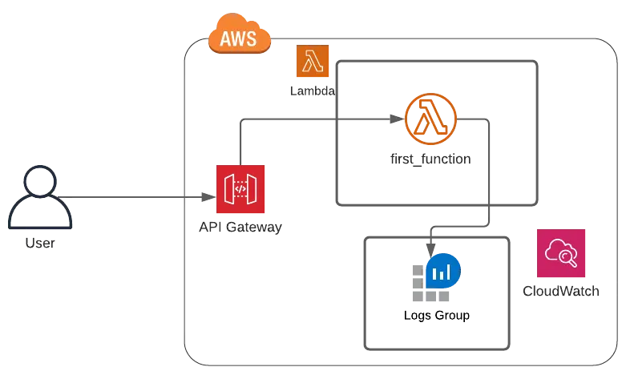
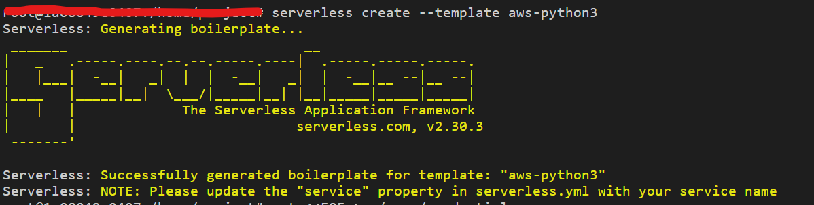
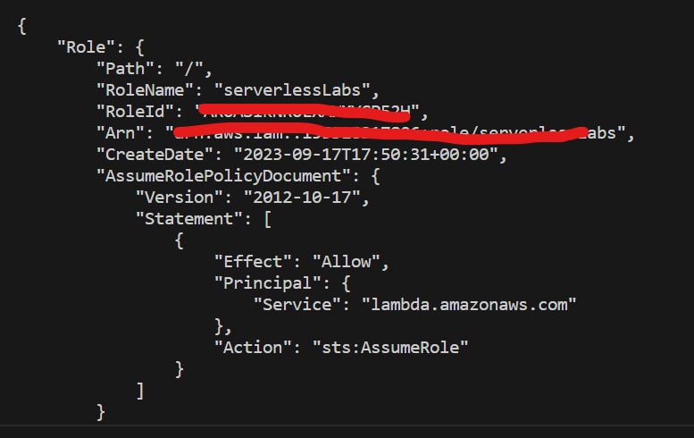
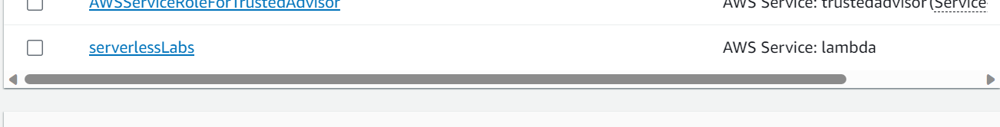
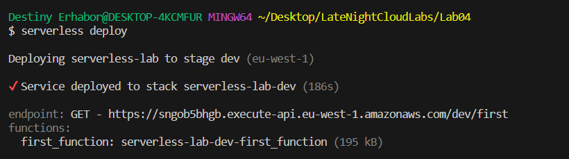
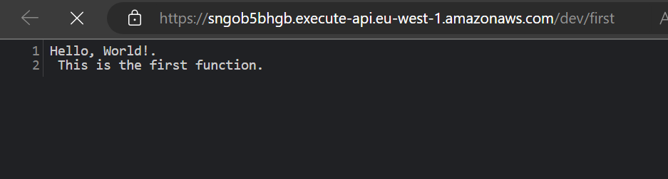
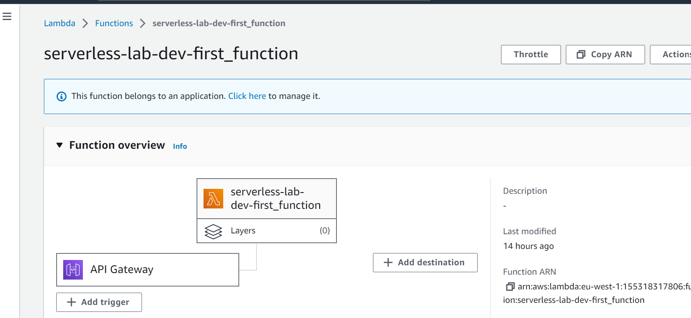
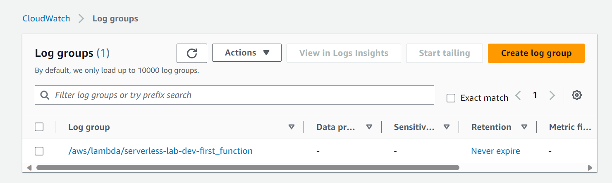

## Using Serverless Framework to deploy simple python function to AWS Lambda, API Gateway, and CloudWatch.



### Prerequisites
- [AWS account](console.aws.amazon.com)
- [AWS CLI](https://docs.aws.amazon.com/cli/latest/userguide/cli-chap-install.html)
- [Serverless framework](https://www.serverless.com/framework/docs/getting-started/)

# Project Description
This project is a simple python function that is deployed to AWS Lambda, API Gateway, and CloudWatch using the Serverless Framework. The function is triggered by an HTTP GET request and returns a simple string. The function is deployed to the eu-west-1 region.

## Installations and Generating Project Template with Serverless Framework

- Install Serverless Framework

```bash
npm install -g serverless
```

- Create a new Serverless Framework project, enter the command and follow the prompt:

```bash
serverless 
```
- Choose AWS Python Starter from the template list
- Give it any name of your choice, here i used serverless-lab



- After the command completes successfully, you will see the two main components created: 
`serverless.yaml`, and `handler.py`

## Configuring the AWS CLI

- You now need to set the AWS credentials for the AWS CLI if you have not. You will be using it along with the Serverless Framework to deploy the resources on AWS. Create the AWS credentials file by entering the following command:

```bash
  cat <<EOF > ~/.aws/credentials
    [default]
    aws_access_key_id = <REPLACE_WITH_YOUR_SECRET_KEY>
    aws_secret_access_key = <REPLACE_WITH_YOUR_ACCESS_KEY> 
  EOF
```

```bash
  cat <<EOF > ~/.aws/config
    [default]
    region = eu-west-1
    output = json
  EOF
```

## Creating the IAM Role

- You need to create an IAM role that will be used by the Serverless Framework to deploy the resources on AWS. Enter the following command to create the role:

```bash
  aws iam create-role --role-name serverlessLabs --assume-role-policy-document '{
  "Version": "2012-10-17",
  "Statement": [
    {
      "Effect": "Allow",
      "Principal": {
        "Service": "lambda.amazonaws.com"
      },
      "Action": "sts:AssumeRole"
    }
  ]
}' --profile personalCaesarAcc
```

> This command creates a role named serverlesslabs on my personalCaesarAcc, hence (--profile) if your credentials are default, then ignore.

This policy allows the role to be assumed by the AWS Lambda service.



- Enter the following command to attach the AWSLambdaBasicExecutionRole policy to the role:

```bash
  aws iam attach-role-policy --role-name serverlessLabs --policy-arn arn:aws:iam::aws:policy/AWSLambda_FullAccess --profile personalCaesarAcc
```

- To verify that the role has been created successfully, you can run the following command to get information about the IAM role.
  
```bash
  aws iam get-role --role-name serverlessLabs --profile personalCaesarAcc
```



## Creating the Project 

- In order to better handle the functions let's create a folder named functions, and create a file named __init__.py inside it
  
```bash
  mkdir functions
  touch functions/__init__.py
```

- Create your first function by creating a file named `first_function.py` inside the functions folder
  
```bash
  touch functions/first_function.py
```

- Open the `first_function.py` file, and enter the following Python snippets to define the function you will deploy:

```py
def first_function(event, context):
  print("The first function has been invoked!!")
  return {
    'statusCode': 200,
    'body': "Hello, World!.\n This is the first function."
  }
```
> This is a simple Python function that returns a JSON object with a status code and a body. As you can see, you inserted the two parameters required from the functions due to the Serverless Framework convention.

- Open the handler.py file and delete the whole content and enter the following Python snippets to define the handler that will be invoked when the function is triggered:

```py
from functions.first_function import first_function
```
> This is the way you expose the function you created in the first_function.py file. You imported the function and you exposed it to the framework.

## Configuring the Serverless Framework

- Open the serverless.yaml file and delete the whole content and enter the following YAML snippets to define the microservice you will deploy:

```yaml

service: serverless-lab

provider:
  name: aws
  runtime: python3.7
  lambdaHashingVersion: 20201221
  region: eu-west-1
  profile: personalCaesarAcc
  timeout: 10 # You set a timeout of 10 seconds for the functions
  role: arn:aws:iam::155318317806:role/serverlessLabs # Enter your Arn role here
  memorySize: 512

functions:
  first_function:
    handler: handler.first_function
    events:
    - http:
        path: first
        method: get     
```
 > This command creates the template for serverless framework to deploy on my personalCaesarAcc AWS account configured on my local machine, hence (--profile) if your credentials are default, then ignore.

## Deploying the Microservice

- Enter the following command to deploy the microservice on AWS:

```bash
  serverless deploy
```
- After a while, you will see the script completes and it will output information like the endpoint, hosted on API Gateway, to trigger the function you just deployed



- As you can see, you have a single function named first_function, and a single HTTP GET endpoint.



- The framework deployed the function on AWS Lambda and, because you attached an HTTP trigger to it, it has deployed an API on API Gateway to let the function be reachable.



## Test the application

- Because you inserted a print in your function, the log is automatically saved on AWS CloudWatch. Enter the following command to access the function's logs:
  
```bash
  serverless logs -f first_function
```

AWS CloudWatch is the native AWS logging service. You can find log groups, single logs, and you can also apply filter expressions on logs to retrieve those you most need.



## Clean up

- To delete the microservice you just deployed, enter the following command:

```bash
  serverless remove
```

